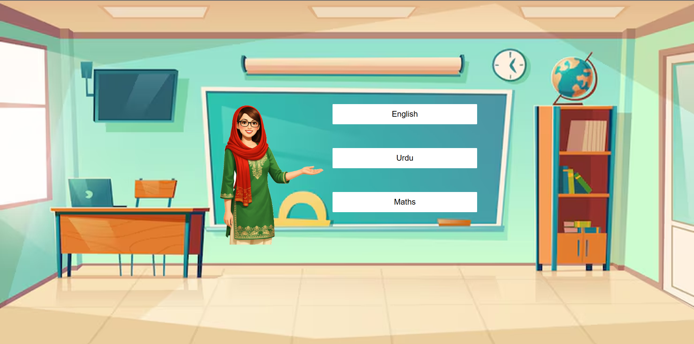

# Classroom Design

## Description
An interactive classroom board application where hovering over subject boxes changes the teacher's pointing pose. Built with HTML, CSS, and JavaScript.

## Screenshot

## Technologies Used
- HTML5
- CSS3
- JavaScript (Vanilla)

## JavaScript Methods
- `changeTeacher(position)`: Updates the teacher image source based on the hover position ('up', 'middle', 'down')
- `resetTeacher()`: Resets the teacher image back to the default middle position

## CSS Modules
- `.container`: Flex container for centering content
- `.teacher`: Container for teacher image with positioning
- `.board`: Flex container for subject boxes arranged vertically
- `.box`: Individual subject boxes with hover effects
- CSS Custom Properties (`:root`): Variables for teacher dimensions, gaps, and board offset for easy customization

## How to Run
Open `index.html` in a modern web browser.
