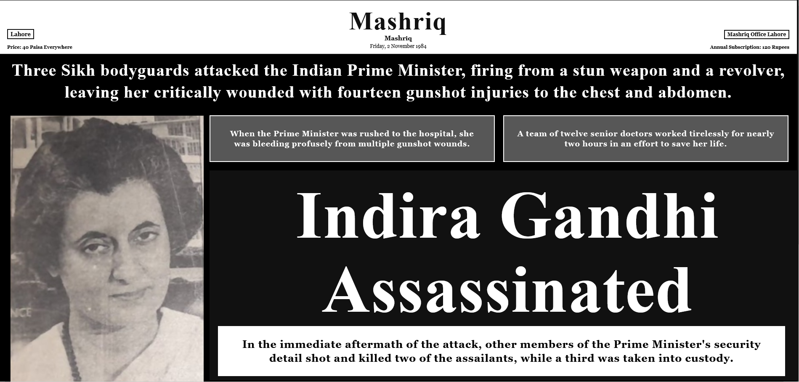

# HTML Newspaper Recreation - Mashriq

## Student Information
- **Name:** Sana Ullah
- **Roll Number:** 22P-9038
- **Section:** BCS-8B
- **Course:** CS-4070 Web Technologies (8th Semester)

## Original Newspaper
- **Name:** روزنامہ مشرق (Roznama Mashriq) / Mashriq
- **Date:** Friday, 2 November 1984
- **Edition/City:** Lahore
- **Source:** "https://www.facebook.com/photo/?fbid=614166131760193&set=gm.1508791840313639&idorvanity=704858387373659"

## Project Description
This project recreates a pre-1990 Urdu newspaper front page into English version, using HTML only (no external CSS and no JavaScript). The goal was to achieve a newspaper-like multi-column layout with semantic HTML5 tags while keeping the structure clean and explainable for the viva.

## Repository Structure
- `index.html` — Main HTML file for the newspaper layout
- `images/`
  - `original-newspaper.jpg` — Scan/photo of the original newspaper front page
  - `original-newspaper-scan.jpeg` — Scan of original newspaper front page
  - `Original Portrait.PNG` — Indria Gandhi's Portrait (Main section)
  - `rajiv gandhi.png` — Article image (lower section)
  - `front Page.PNG` — For GitHub's Readme page
- `explanation.pdf` — One-page explanation of code structure
- `README.md` — This file

## Features Implemented
- HTML5 structure with `<!DOCTYPE html>` and semantic tags (`header`, `nav`, `section`, `article`, `footer`)
- **Three-column layout using a `<table>`** (required)
- **At least 3 images** (masthead/logo + lead photo + article photo), all with `alt` attributes
- Proper heading hierarchy (`h1` used for masthead, internal headings included for structure)
- A navigation **list (`ul`)** inside `<nav>`
- Clear HTML comments for major sections
- Inline styles only (`style=""`) as allowed (no external CSS files)

## Challenges Faced
Creating a newspaper-style layout without external CSS was challenging, especially for column alignment. I solved this by using a table for the main multi-column section and simple inline styling (borders, spacing, alignment) to keep the layout visually similar to the original scan.
